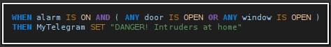

# What is Mingle?

> A human-like declarative language called _Une_ and the associated tools.
>
> You don't need to know how to program: if you know how to use a spreadsheet (like MS Excel), you can create applications.
>
> _Une_ is better suited for the IoT (although is not limited to it).

# How looks it like?

> Here is how to say: “When the alarm is on and any door or window is opened, then send to my Telegram the message 'DANGER! Intruders at home'”.
>
> 
>

# Questions and Answers

 **Do I need to know about computer programming?**

> No, you do not: as far as you are familiar with spreadsheets (e.g.: MS Excel) you can successfully use _Une_.
> It is also true that the more you know about programming computers, the more you will be able to do.

 **What computer do I need?**

> A PC with Windows, macOS or Linux. In fact, **Mingle** would run in any machine where Java 11 (or above) can run.
> Raspberry Pi is a cheap computer very appropriate to experiment with _Une_.

 **How to install Mingle?**

> Download lastest release (mingle.n.n.n.zip) and unzip it: that is all.

 **What is the easiest way to start?**

> To make things simple, all tools are integrated in the IDE, which is called "**Glue**".
>
> So, our recommendation is:
> 1.  Start **Glue** (for Linux, use "menu.sh"; for Windows "run-win.ps1", for MacOS "run-mac.sh").
> 2.  Open the editor (click the pencil icon at toolbar).
> 3.  Open an example (under the 'examples' folder): they are numbered from easiest to smartest.
> 4.  Read, understand and test (run it).
> 5.  Modify the _Une_ source code and re-test.
> 6.  Go to #3

 **What license has Mingle?**

> All code is Open Source under the Apache License 2.0.
>
> The books (licensed as Creative Commons) are under "docs" folder:
> * Une_language.pdf
> * Mingle_Standard__Platform.pdf
> * Une_reference__sheet.pdf
> * javdocs.zip: APIs documentation in HTML fomat

 **What about the logo?**

> Following the Open Source tradition, the mascot for the _Une_ language is an animal, in this case, an electric anguilla named **Tune**. You are allowed to use it anywhere, as long as it's related to **Mingle** or _Une_.

